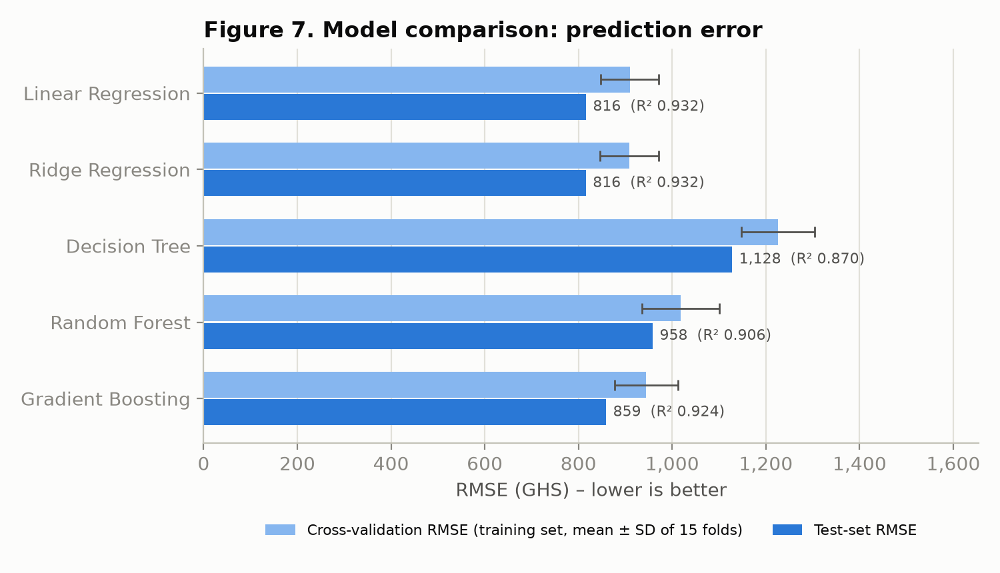
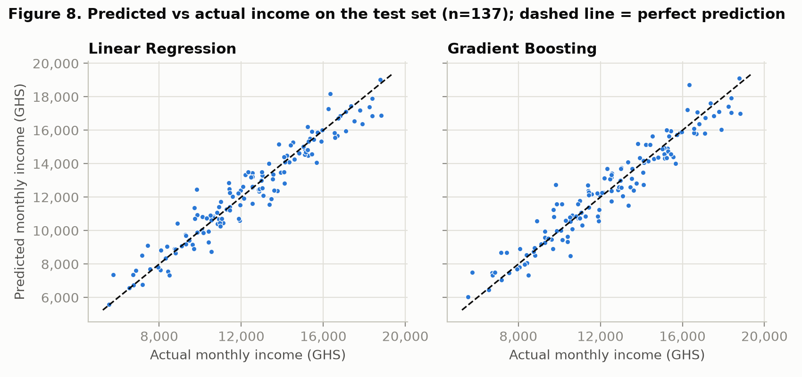
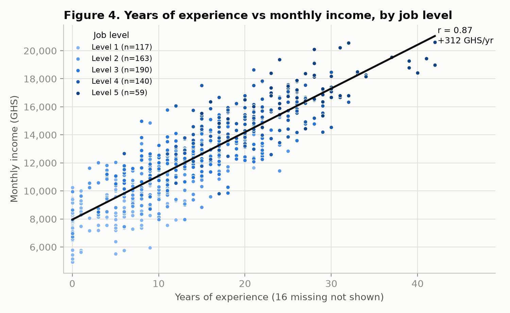

# Predicting Employee Monthly Income with Machine Learning

An end-to-end regression project that predicts an employee's monthly income (GHS) from their characteristics. It covers data cleaning, exploratory analysis, feature engineering and model comparison, and it is built around a careful evaluation design: no leakage from the test set, repeated cross-validation, paired model comparisons, bootstrap confidence intervals and a fairness check.

**Best model:** multiple linear regression. On 137 held-out employees it scored **R² 0.932**, with a mean absolute error of **GHS 624** (about 5% of average income).



---

## The problem

Given an employee's age, gender, education, years of experience, department, job level, weekly hours, performance score and training hours, how accurately can we predict their monthly income? Which factors actually matter?

## The data

An HR dataset of 712 employee records, with 10 attributes and the target `Monthly_Income`. It was supplied as coursework practice data and is **not included in this repository**. To run the code, place your copy at `data/employee_income_original.csv`.

The raw data contained deliberate quality problems, which are fixed in the cleaning step:

| Problem | Count | How it was handled |
|---|---|---|
| Exact duplicate rows | 12 | Removed |
| Inconsistent category spellings (e.g. `F`, `female`, `I.T.`, `Mktg`) | 16 cells | Standardised |
| Impossible ages (5, 120, 150) and weekly hours (−10, 100, 140) | 10 cells | Set to missing, then imputed inside the model pipeline |
| Missing target (income) | 10 rows | Removed (the target is never imputed) |
| Extreme incomes of GHS 73k–155k, when every other employee earns at most GHS 20.6k | 5 rows | Removed: 7–9× their job-level median, and dividing by 10 did not reliably recover a sensible value |

This left **685 employees**. Genuine but unusual values, such as training hours up to 100, were kept.

## Approach

1. **Data understanding** (`code/01_data_understanding.py`): data types, descriptive statistics, missing values, duplicates, category spellings and range checks.
2. **Cleaning** (`code/02_data_cleaning.py`): the rules above, applied to a copy of the raw file and written to a change log.
3. **Exploratory analysis** (`code/03_eda.py`): six figures and group comparisons (Kruskal–Wallis, ANOVA, correlations).
4. **Feature engineering and modelling** (`code/04_models.py`):
   - **Encoding:** education as ordinal (High School → PhD); department one-hot; job level kept as 1–5.
   - **Excluded predictors:** `Employee_ID` (an identifier); `Gender`, which has no relationship with income (p = 0.82) and should not drive pay predictions; raw `Age`, which correlates 0.96 with experience.
   - **Engineered features:**
     - `Career_Start_Age` = Age − Experience. It keeps the information in age without duplicating experience, and lets a missing age or experience be filled from the other.
     - `Experience_per_Level` = years of experience per job grade, a measure of progression speed.
   - **No leakage:** every imputation, encoding and scaling step sits inside a scikit-learn `Pipeline` fitted on the training data only.
   - **Split:** 80/20 train/test, stratified by job level, fixed seed.
   - **Models:** a baseline (mean), linear regression, Ridge, a decision tree, a random forest and gradient boosting. Settings were tuned by 5-fold cross-validation and compared with repeated 5-fold CV (15 fits per model).
5. **Final checks** (`code/05_final_model_checks.py`): paired fold-by-fold comparison, bootstrap 95% intervals, coefficients in GHS, and errors by gender.

## Results

| Model | CV RMSE (± SD) | CV R² | Train R² | Test MAE | Test RMSE | Test R² |
|---|---|---|---|---|---|---|
| Baseline (mean) | 3,102 (± 145) | −0.007 | 0.000 | 2,595 | 3,122 | 0.000 |
| **Linear Regression** | **909 (± 62)** | **0.913** | 0.918 | **624** | **816** | **0.932** |
| Ridge Regression | 909 (± 63) | 0.913 | 0.918 | 619 | 816 | 0.932 |
| Decision Tree | 1,226 (± 78) | 0.842 | 0.909 | 887 | 1,128 | 0.870 |
| Random Forest | 1,019 (± 83) | 0.891 | **0.985** | 753 | 958 | 0.906 |
| Gradient Boosting | 944 (± 68) | 0.906 | 0.941 | 664 | 859 | 0.924 |

All errors are in GHS. CV is repeated 5-fold cross-validation on the training set.

**Why linear regression, and not simply the highest R²:**
- **Lowest error, consistently.** It beat gradient boosting in **14 of 15** cross-validation folds (mean difference GHS 35, standard error 7).
- **Effectively tied with Ridge.** Ridge differs by GHS −0.8 (standard error 2.1), so the simpler model wins.
- **No overfitting.** Its training and cross-validated R² are nearly equal. The random forest scores 0.985 on training data but 0.891 in cross-validation.
- **Interpretable.** Every coefficient reads directly in GHS.
- **Bootstrap 95% intervals on the test set:** MAE GHS 539–706; R² 0.908–0.949.



## What drives income

Holding the other factors constant, the linear model gives:

| Factor | Effect on monthly income |
|---|---|
| Job level | +GHS 1,196 per level |
| Education | +GHS 766 per step (High School → Diploma → Bachelor's → Master's → PhD) |
| Performance score | +GHS 441 per point |
| Years of experience | +GHS 174 per year |
| Department (vs Finance) | IT +203; HR −239; Marketing −347; Operations −396 |
| Hours per week, training hours | about zero |

Job level and experience are each correlated 0.87 with income, and education still raises pay within every job level. Department differences only appear after adjusting for the other factors, and they barely affect prediction accuracy. Gender shows no relationship with income: median GHS 12,275 for women against 12,321 for men.



## Example prediction

A 38-year-old with a Master's degree, 10 years' experience, working in IT at job level 3, 42 hours a week, performance score 4.2 and 35 training hours:

**Predicted income: GHS 13,299 a month** (realistic range about GHS 12,300–14,400)

This sits inside the range for similar employees in the data. Level-3 IT staff have a median of GHS 13,324, and level-3 Master's holders with 8–12 years' experience range from GHS 10,745 to 14,098.

## Limitations

- **Very high earners are outside the model.** Removing the five extreme incomes means it cannot predict above about GHS 20,600.
- **Senior staff are under-predicted** by about GHS 428 on average, from a small group (13 test employees at the top level).
- **Typical errors are somewhat larger for women** (MAE GHS 692 vs 558, although average errors are close to zero for both). This is worth monitoring with more data.
- **Associations, not causes.** The data is a single snapshot, so the coefficients show what goes together with income, not what causes it.

## How to run

Requires Python 3.13 (other recent versions should also work).

```bash
python -m venv .venv
```

Activate the environment. On Windows:

```bash
.venv\Scripts\activate
```

On macOS or Linux:

```bash
source .venv/bin/activate
```

Install the packages:

```bash
pip install -r requirements.txt
```

Put the dataset at `data/employee_income_original.csv`, then run the scripts in order:

```bash
python code/01_data_understanding.py
python code/02_data_cleaning.py
python code/03_eda.py
python code/04_models.py
python code/05_final_model_checks.py
```

Figures are written to `figures/` and tables and logs to `outputs/`. Results are reproducible: every random step uses seed 42.

## Project structure

```
├── code/
│   ├── 01_data_understanding.py   # profile of the raw data
│   ├── 02_data_cleaning.py        # cleaning rules -> data/employee_income_clean.csv
│   ├── 03_eda.py                  # statistics and figures 1-6
│   ├── 04_models.py               # pipeline, feature engineering, models, figures 7-9
│   └── 05_final_model_checks.py   # paired comparison, bootstrap, coefficients, fairness check
├── data/                          # not tracked: add employee_income_original.csv here
├── figures/                       # all charts
├── outputs/                       # printed results, cleaning log, model tables
├── requirements.txt
└── README.md
```

## Use of AI

This project was built with the help of Claude (Anthropic), which wrote and ran much of the analysis code under my direction. I reviewed the results and decisions. I also consulted separate AI instances on data quality, feature engineering and model selection, checked their claims against the data, and rejected or modified several suggestions where the evidence did not support them.

## Author

**Wilson Gyebi Asante**, MSc Data Analytics, University of Ghana
